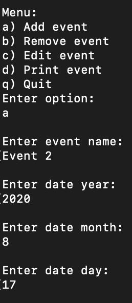
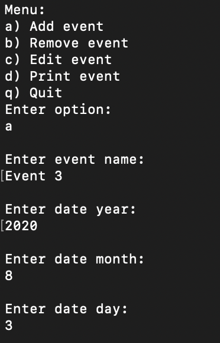
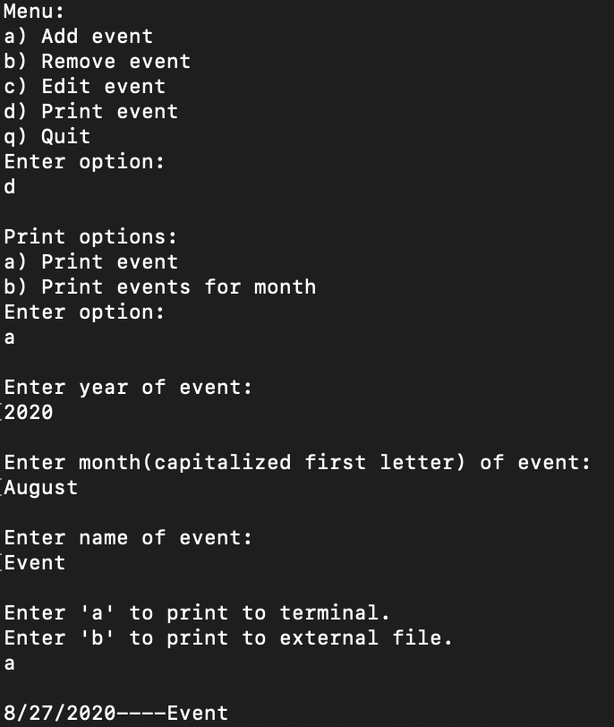
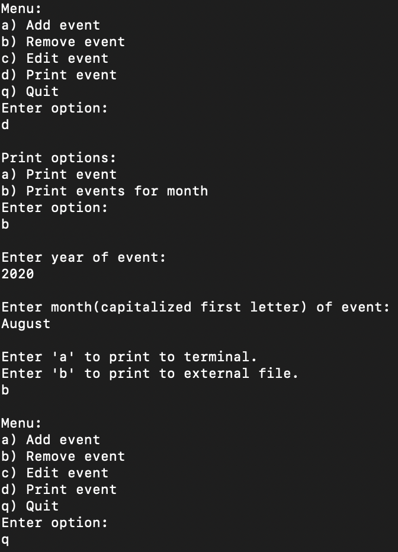
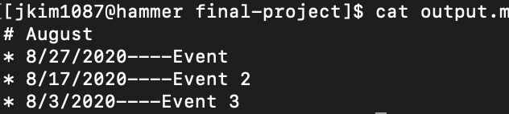

# Calendar
 
 > Authors: [Sophie Si](https://github.com/sophie-si)  
 > Authors: [Erik Kanamori](https://github.com/erik-kan)  
 > Authors: [Jonathan Kim](https://github.com/jonathanykim)  

## Project Description
* Design patterns 
 	- Composite used to create storage for the events
	- Strategy used to apply various forms of printing
	- Singleton used in the formation of a menu (user interface)
* Why is it important or interesting to you?
	- One of the things that led to our decision of the project is that what we value most is the project's utility as well as its potential to be continuously improved upon
	- A calendar application can be made to become something that is practical for the everyday college student as a great way to study for various classes
	- Calendar would have to connect with the actual time and date to be accurate 
	- Can be used to also set up reminders for birthdays, holidays, and other special events
	- Can set reminders or messages for certain individuals on a specific day
	- Can repeat specific schedules, reminders or events, daily/weekly/monthly/annually so user does not need to create it every time
	- Can look up specific dates and provide information such as any events, the day of the week, and numerical date
	- Each day will need to have is own unique set of information that have similar foundations to each other but may contain different info as things are added or removed
* What languages/tools/technologies do you plan to use?
	- C++
	- Putty
	- Hammer remote servers
	- Git hub
* What will be the input/output of your project?
	- Input 
		+ Commands 
			+ Create event
			+ Print event
			+ Repeat schedules 
			+ Clear the day of all edits
			+ Get date

		+ Events
			+ Reminders
			+ Search
				+ By date
				+ By event/reminder
	- Output
		+ Print event information to external output.md file
		+ Print event date info to terminal
		+ User interface/menu

## Class Diagram
 
 
 * Description:
	- Contains an object for maintaining a menu, a tree of type storage for containing and organizing tasks and a printer class for showing tasks in different ways.
		+ Event and term classes inherit from the storage class where they will be involved with defining the event object and the time periods in which the events are contained
		+ Two types of printer classes (SimplePrinter and DetailedPrinter) allow for the user to specify the type of output they would like to produce. The varying outputs are an implementation of the strategy design pattern. 
		+ Menu class manages user input to perform operations with the other classes. 

## Screenshots
### Add Event #1

### Add Event #2

### Add Event #3

### Print Event in terminal

### Print events for August to output.md file

### Display output.md file

## Installation/Usage
1. Run `cmake .` in terminal
2. Run `make` in terminal
3. Run `prog` in terminal

## Testing
* Tested & validated with tests in unit_test.cpp
