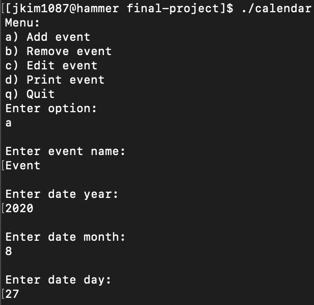
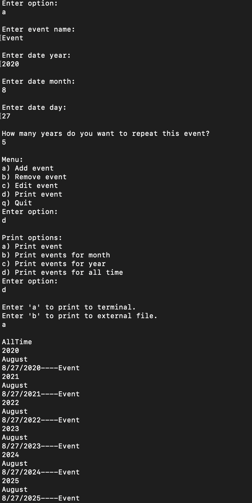

# Calendar
 
 > Authors: [Sophie Si](https://github.com/sophie-si)  
 > Authors: [Erik Kanamori](https://github.com/erik-kan)  
 > Authors: [Jonathan Kim](https://github.com/jonathanykim)  
 
## Phase 3 - Final Sprint (8/31/20-9/4/20)
* Add weeklyEvent Creation function
* Add monthlyEventCreation function
* Add dailyEventCreation function
* Add a function to create all national holidays as events 
* Save calendar data from previous usage by user / Import output.md to program
* Implement sort for years and months
* Finish feature to edit events
* Add and access description/details for events

## Current features
* Add events
* Remove Events
* Print events to terminal
* Print events to output.md
* Specify print group by all-time, year, month, or event
* Recurring scheduling for event by year

## Project Description
* Design patterns 
 	- Composite used to create storage for the events
	- Strategy used to apply various forms of printing
	- Singleton used in the formation of a menu (user interface)
* Why is it important or interesting to you?
	- One of the things that led to our decision of the project is that what we value most is the project's utility as well as its potential to be continuously improved upon
	- A calendar application can be made to become something that is practical for the everyday college student as a great way to study for various classes
	- Calendar would have to connect with the actual time and date to be accurate 
	- Can be used to also set up reminders for birthdays, holidays, and other special events
	- Can set reminders or messages for certain individuals on a specific day
	- Can repeat specific schedules, reminders or events, daily/weekly/monthly/annually so user does not need to create it every time
	- Can look up specific dates and provide information such as any events, the day of the week, and numerical date
	- Each day will need to have is own unique set of information that have similar foundations to each other but may contain different info as things are added or removed
* What languages/tools/technologies do you plan to use?
	- C++: For coding & compilation
	- Putty: Access server to edit files.
	- Hammer remote servers: Store and use files for editing.
	- Git hub: Keep track of program edit history
* What will be the input/output of your project?
	- Input 
		+ Commands 
			+ Create event
			+ Print event
			+ Repeat schedules 
			+ Clear the day of all edits
			+ Get date
		+ Events
			+ Reminders
			+ Search
				+ By date
				+ By event/reminder
	- Output
		+ Print event information to external output.md file
		+ Print event date info to terminal
		+ User interface/menu

## Class Diagram

* Description:
	- Contains an object for maintaining a menu, a tree of type storage for containing and organizing tasks, and a printer class for showing tasks in different ways.
		+ Event and term classes inherit from the storage class where they will be involved with defining the event object and the time periods in which the events are contained
		+ Two types of printer classes (SimplePrinter and MdFilePrinter) allow for the user to specify the type of output they would like to produce. The varying outputs are an implementation of the strategy design pattern. 
			+ MdFilePrinter used to change output location. Other locations such as to GUI may be later implemented here
		+ Menu class manages user input to perform operations with the other classes. 

## Screenshots / Demo of Code
### Add Event #1

### Add Event #2

### Add Event #3

### Print Event in terminal

### Print events for August to output.md file

### Display output.md file

### Yearly recurring scheduling and printing events from all-time

## Installation/Usage
1. Run `cmake3 .` in terminal
2. Run `make` in terminal
3. Run `./cal` in terminal
4. Follow instructions from user interface and use calendar

## Testing
* Tested & validated with tests in `unit_test.cpp` and tests in pertaining header files
* Also tested via CI tester with github actions. Checks all branches and pull requests to master
* Run `./test` to see results for tests
